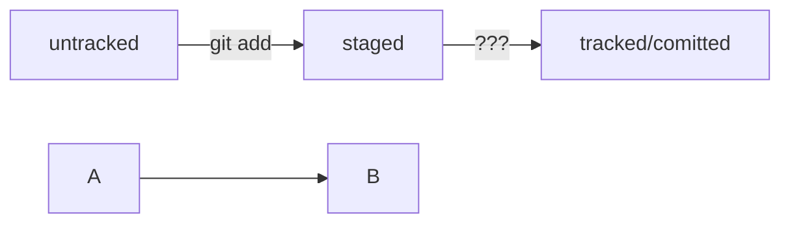

# _**Шпаргалка markdown**_

## Выделение текста

# Заголовок первого уровня
## Заголовок второго уровня
### Заголовок третьего уровня

## Выделение кода
Чтобы выделить текст как код, поместите его в тройные кавычки `````. 
```
mkdir my_project
cd my_project
git init
```
Это лишь некоторые функции markdown. 

```
cd - сменить путь
pwd - файлы в данной папке
touch - создание файла
git add - добавление на отслеживание
git commit - создание комментария
git push - синхронизировать локальные данные с гитхабом
```
HEAD -- это голова.
Коммит -- это всему голова.
Статусы файлов:
<тут пустая строка!>

```mermaid
%% описание схемы
```
<и тут пустая строка!> 



